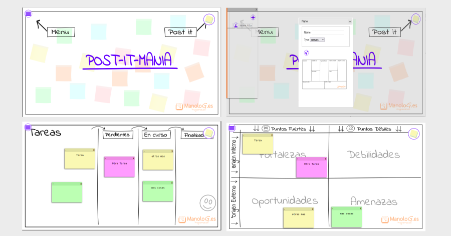

# Post-it free, Aplicación online para construir canvas, kanban, mapa de empatia y más, con postits gratis

La aplicación es sencilla y no tiene mucha complejidad que suge como un experimento de aplicación on line
construida en javascript, con la intencion de aplicar el concepto de con almacenamiento de datos en el localstoraje
y la tecnoligia de guardar datos en archivos y importar datos de archivo desde el navegador.

La idea del diseño inicialmente quería que fuese muy visual, sin nada de texto, pero al final he ido incorporando algunos textos para darle más legibilidad.

Para que funcione en local necesitamos un servidor local, si estamos en linux podemos usar el de python

    python -m SimpleHTTPServer 8000

## la aplicación

El resultado es una aplicación de posits que permite añadir elementos a una pizarra en blanco o
con diseños básicos de canvas, mapa de empátia, kanban o dato donde los posits se pueden mover y cambiar de color
añadir o modificar textos dentro de ellos, se puede guardar el resultado en un archivo y cargar pizarra de archivo.

Todo se almacena en el local storage del ordenador.

demo en https://posits.manolog.es

25/09/2018

